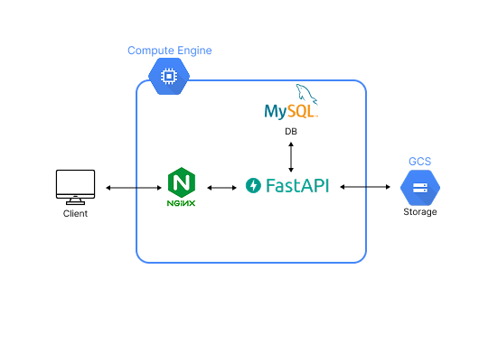
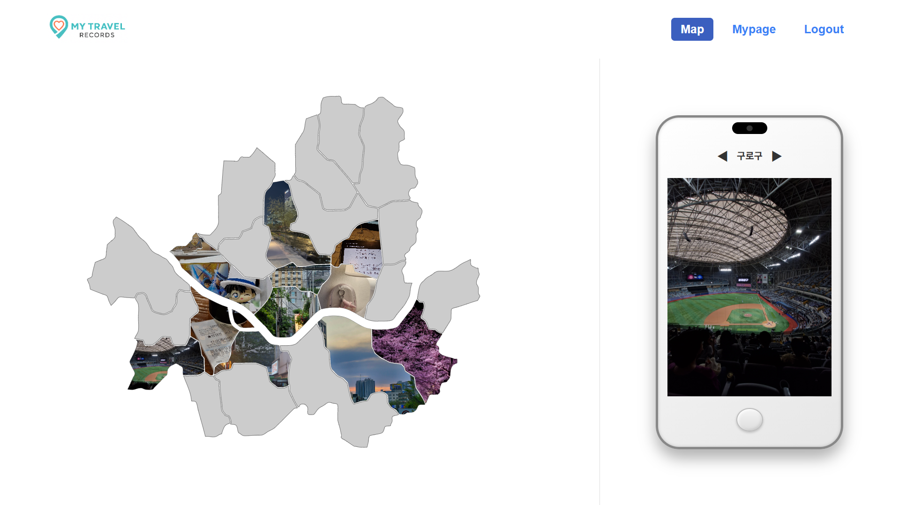
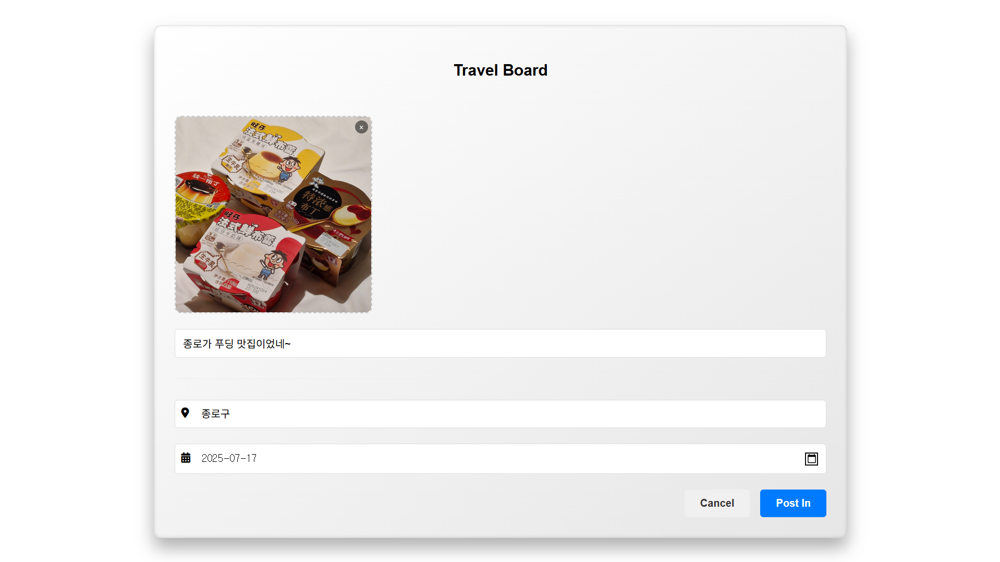
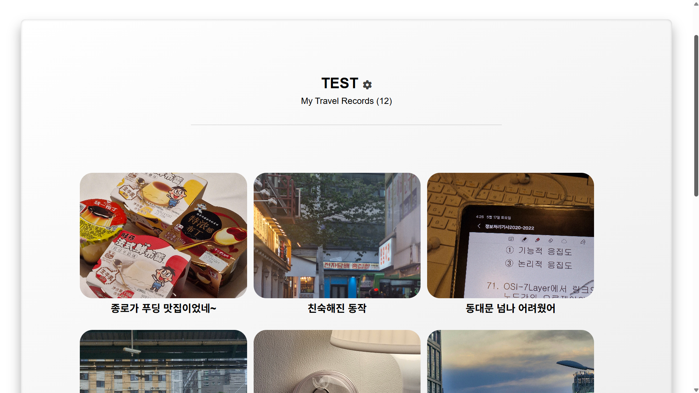
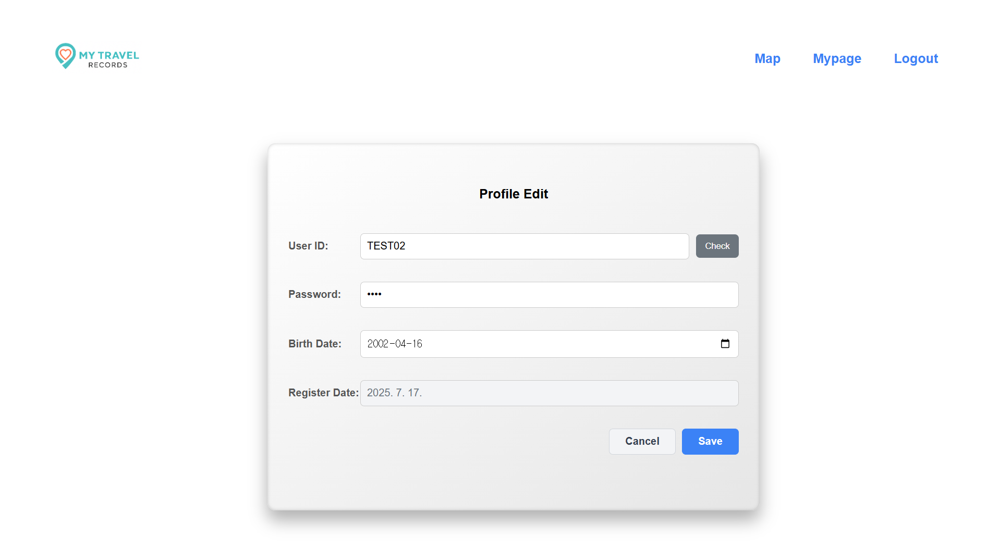

# My Travel Records 
나의 여행 기록

## 프로젝트 개요

이 프로젝트의 목표는 서울시 여행 기록을 구 단위로 저장하고 지도 상에서 시각적으로 확인할 수 있는 게시판 웹 서비스를 만드는 것이다.

- 사용자는 사진, 제목, 자치구, 날짜를 입력해 게시글을 작성할 수 있다.
- 지도 상에 자치구로 구분되어 이미지가 보이고, 자치구를 클릭하면 해당 구에서 작성된 게시글의 이미지들을 확인할 수 있다.
- 전체 시스템은 GCP 인스턴스에서 FastAPI 기반으로 동작하며, 이미지는 사용자의 업로드와 함께 서버(GCP VM)의 디렉터리에 저장되고, 해당 경로를 통해 정적 파일로 서빙된다.

## 기술 스택

- 프론트엔드: HTML, CSS, JavaScript
- 백엔드: Python & FastAPI
- 서버: Nginx, Uvicorn
- DB: MySQL
- 클라우드: GCP
  +  이미지 저장: 로컬 디렉터리 `/uploads/user_x/`, URL 경로만 DB에 저장

## 시스템 아키텍처

## 서비스 플로우

## 구현화면

### Main Page

### Map Page

### Board Page

### My Page

### Board PopUp Page

### Profile Edit Page

---

## 블로그 회고
> [🔗 Velog 바로가기](https://velog.io/@kangte/%ED%94%84%EB%A1%9C%EC%A0%9D%ED%8A%B8-my-travel-records)
